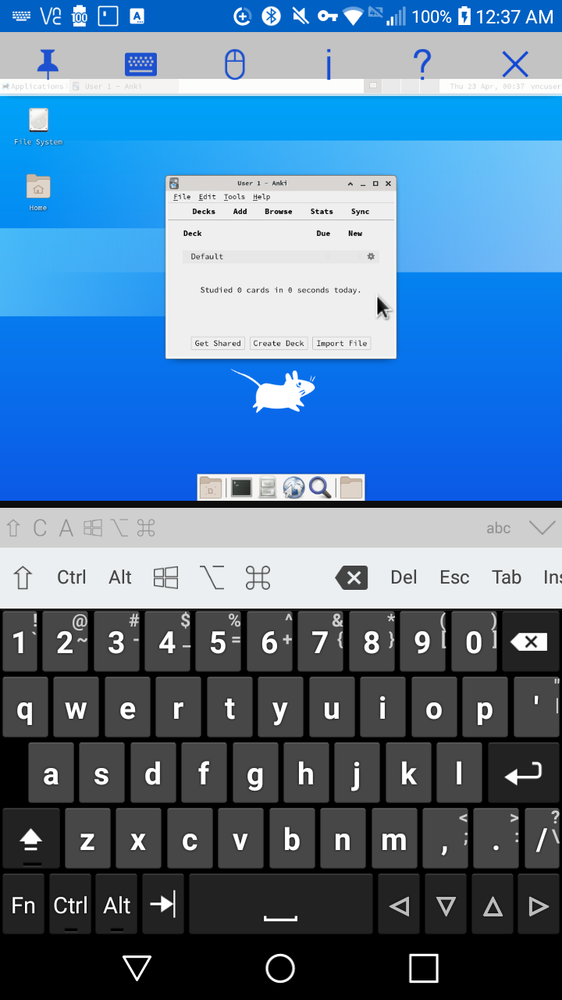

This project uses [TermuxArch](https://github.com/SDRausty/TermuxArch) to install an instance of [Arch Linux ARM](https://archlinuxarm.org/) inside a [PRoot environment](https://proot-me.github.io/) inside of [Termux](https://termux.com/). It then installs and configures Anki, a desktop environment (LXDE), and a VNC Server (tigervnc). [This page](https://archlinuxarm.org/packages/any/anki) shows version of Anki that this project installs. If you already use TermuxArch, see docs/manual installation.md because this project overwrites config files in the proot (namely /etc/pacman.d/mirrorlist).

Install Requirements:
1. Android 5+ (Android 5/6 users can use Termux 0.75 from F-Droid after enabling the the F-Droid Archive repo)
2. 2.3 GB of internal storage space, not including the size of your Anki collection. This project installs and configures a full Linux distro (Arch Linux ARM) with a desktop environment (LXDE) and VNC server (TigerVNC) so that it can run Anki. If you use AnkiDroid and AnkiTermuxArch you will end up with two copies of your collection on your device. It's not yet possible to have the projects share the same copy of an Anki collection.
3. Time. Depending on your device and internet connection, the install may take a few minutes to an hour.
4. Apps:
    * An VNC client app for connecting to a VNC server. This is an important choice because this is the main app you'll use to interact with Anki's GUI. Open-source options include MultiVNC and androidVNC (both available on F-Droid) but I've found VNC Viewer from the Play Store most usable.
    * Termux
    * Termux:Widget if you want an Android shortcut for starting AnkiTermuxArch instead of typing the command in Termux

Install Instructions:
1. Install Termux from F-Droid or the Play Store
2. Plug your device into a charger, connected to WiFi, and turn off mobile data
3. Copy and paste the following line of code into Termux to begin installing

`pkg install git; git clone --recurse-submodules https://github.com/sudomain/AnkiTermuxArch.git; bash ~/AnkiTermuxArch/setup_AnkiTermuxArch.bash`

By default TermuxArch will attempt to download Arch Linux ARM from a server that is geographically near you, but sometimes it will have trouble doing so. If this happens, try the above command again. Manually enabling a nearby mirror is possible (see `TermuxArch/setupTermuxArch.bash help`).

4. If you get a prompt that looks like `[rootXX:XXdir]` then you can type `exit` and press enter. The install will then resume. This wont happen in a future version. 
5. Start the `startarch-gui` script by putting a Termux shortcut in your Android home screen or typing `bash ~/.shortcuts/startarch-gui`.
6. Open your VNC client app and connect with these settings:

Address: `localhost::5901` i.e. connect to your device (localhost) on port 5901

Password: ankiarch

The `startarch-gui` script will automatically open your VNC client app if you have installed VNC Viewer or MultiVNC

7. Click/tap the applications menu in the top left -> Education -> Anki 

The default password can be changed by running the `vncpasswd` command as the vncuser. It doesn't really matter because the VNC server is configured to only allow connections from localhost (the same device it's running on)

Uninstall Instructions:
Uninstalling Termux will remove all files associated with this project. If you want to keep Termux because you use it for other things, run this command to remove everything associated with the Arch install:
`bash TermuxArch/setupTermuxArch.bash purge`

Auxiliary Apps:
1. Hacker's Keyboard (for a keyboard with arrow keys which is useful when switching fields in Anki)

Hardware:
Bluetooth mice/keyboards or a USB OTG adapter recommended.
